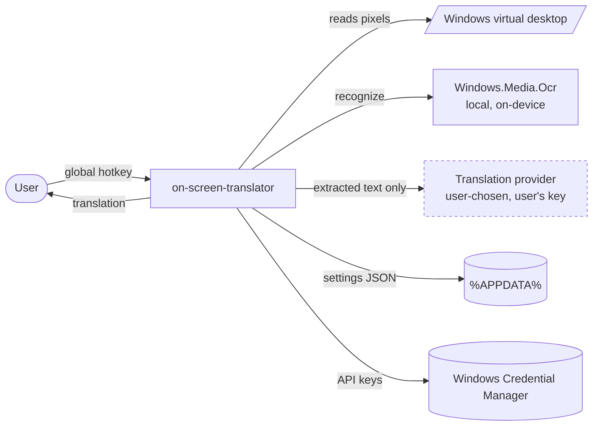
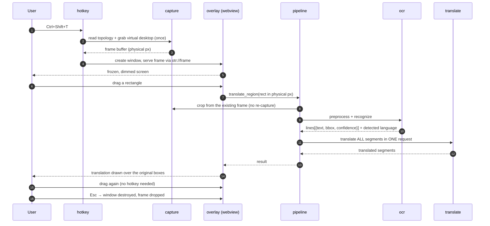

# Architecture Overview

> **Purpose.** How the system is put together and how a capture flows through it. Read this before working anywhere
> in the codebase.
> **Related.** [system-design.md](system-design.md) · [api.md](api.md) · [adr/README.md](adr/README.md) · [../engineering/project-structure.md](../engineering/project-structure.md)

## Context

A Windows tray utility. It is idle almost always, and when triggered it must freeze the screen, let the user select
a region, read the text in it, translate it, and draw the translation back where the words were — in under a second.

The dashed edge is the **only** thing that ever leaves the machine, and it carries text — never the image
([NFR-S1](../product/requirements-nfr.md#security)).

## Components

Two processes' worth of responsibility, split so that everything expensive lives in Rust and only presentation
lives in the webview ([ADR-0001](adr/0001-initial-architecture.md)).

### Rust core (`src-tauri/`)

Owns everything with a cost: OS access, pixels, network, and secrets.

| Module        | Responsibility                                                                                       |
| ------------- | ------------------------------------------------------------------------------------------------------ |
| `app`         | Bootstrap, single-instance guard, window lifecycle, graceful shutdown                                  |
| `tray`        | Tray icon, menu, state badges, `TaskbarCreated` re-registration                                        |
| `hotkey`      | Global shortcut registration, live rebinding, conflict reporting                                       |
| `capture`     | Monitor topology, virtual-desktop bounds, the single frame grab, cropping                              |
| `preprocess`  | Upscale, grayscale, contrast normalize, adaptive threshold                                             |
| `ocr`         | `OcrEngine` trait + `Windows.Media.Ocr` implementation, line assembly, language detection              |
| `translate`   | `TranslationProvider` trait + LibreTranslate / DeepL / Google / LLM implementations, batching          |
| `pipeline`    | Orchestrates crop → preprocess → OCR → translate; owns cancellation and stage timing                   |
| `settings`    | JSON persistence, defaults, corrupt-file recovery, migration                                           |
| `secrets`     | Windows Credential Manager read/write — the only module that touches API keys                          |
| `autostart`   | `HKCU` run entry, stale-path repair                                                                    |
| `ipc`         | Tauri command handlers and event emission — the contract in [api.md](api.md)                           |

### Frontend (`src/`)

React + TypeScript + Tailwind. Three windows, each created on demand and destroyed after use.

| Window     | Role                                                                                                            |
| ---------- | ----------------------------------------------------------------------------------------------------------------- |
| `overlay`  | Renders the frozen frame, the dim scrim, the drag selection, and the in-place translated text. The main surface.  |
| `panel`    | Frameless always-on-top result panel: source, translation, copy buttons, re-translate.                            |
| `settings` | The small configuration window.                                                                                   |

The frontend has **no** network access, **no** filesystem access, and never sees a secret
([NFR-S5](../product/requirements-nfr.md#security)). It receives pixels and text and returns rectangles.

## Data Flow

The whole product, in one sequence:

**The four properties this flow exists to guarantee:**

1. **Capture happens once** per overlay session; every selection is a memory crop
   ([ADR-0004](adr/0004-capture-and-coordinate-model.md)).
2. **One coordinate space** — physical pixels in virtual-desktop space, converted exactly once at the webview
   boundary. This is the invariant that keeps mixed-DPI multi-monitor correct.
3. **One outbound request** per capture, carrying text only
   ([ADR-0003](adr/0003-translation-provider-abstraction.md)).
4. **Nothing runs while idle** — no timer, no watcher, no window. The process sleeps until the hotkey fires
   ([NFR-P5](../product/requirements-nfr.md#performance)).

## Tech Stack

| Layer         | Choice                                              | Why                                                                                |
| ------------- | --------------------------------------------------- | ------------------------------------------------------------------------------------ |
| Shell         | **Tauri v2**                                        | System WebView2 instead of a bundled Chromium; windows on demand; ~5–15 MB install   |
| Core language | **Rust**                                            | First-class WinRT bindings via the `windows` crate; no GC pauses in the hot path      |
| UI            | **React + TypeScript + Tailwind** (Vite)            | The overlay's text-fitting problem is a layout problem, and CSS is where that's cheap |
| OCR           | **`Windows.Media.Ocr`**, behind `OcrEngine`         | Zero bytes added, OS-accelerated, per-line boxes — see [ADR-0002](adr/0002-ocr-engine.md) |
| Translation   | **Pluggable providers**, user's own key             | No server, no shipped key — see [ADR-0003](adr/0003-translation-provider-abstraction.md) |
| Settings      | **One JSON file** in `%APPDATA%`                    | There is nothing relational here; a database would be complexity without a requirement |
| Secrets       | **Windows Credential Manager**                      | Keys must never touch the settings file or the logs                                   |
| Logging       | **`tracing`** to a rolling file                     | Structured, with a hard rule against logging captured content                         |
| Distribution  | **GitHub Releases** (MSI + portable), MIT           | Zero cost, no infrastructure to run                                                   |

**Deliberately absent:** no database, no backend, no state-management library, no router, no telemetry SDK, no
auto-updater. Each was considered and rejected as complexity without a requirement behind it.

## Key Decisions

Full reasoning in [adr/README.md](adr/README.md):

- **[ADR-0001](adr/0001-initial-architecture.md)** — Tauri v2 with a strict Rust/frontend split. Electron misses the
  30 MB idle budget by roughly 8×; Python and Go can't reach WinRT cleanly.
- **[ADR-0002](adr/0002-ocr-engine.md)** — `Windows.Media.Ocr` behind a trait. Our input is always rendered screen
  text, never photographs, which is exactly what the OS engine is tuned for — and it costs zero install bytes.
- **[ADR-0003](adr/0003-translation-provider-abstraction.md)** — pluggable providers, user-supplied keys, one batched
  request per capture. No shipped key, no server, and the keyless default is the known weak point
  ([TD-02](../project/tech-debt.md)).
- **[ADR-0004](adr/0004-capture-and-coordinate-model.md)** — capture the whole virtual desktop once into physical
  pixels. This is the decision that prevents the mixed-DPI bug class that afflicts every tool in this category.

## Where the risk lives

If this project fails technically, it fails in one of these four places. Treat them with extra care:

1. **Coordinate math** — invisible on a single-monitor dev machine, broken for everyone else.
2. **OCR accuracy on small text** — bounded by the engine; only pre-processing is under our control
   ([TD-01](../project/tech-debt.md)).
3. **Batch segment alignment** — a provider that merges or splits segments silently breaks the in-place overlay
   ([TD-06](../project/tech-debt.md)).
4. **The keyless default provider** — the first-run experience depends on infrastructure nobody owes us
   ([TD-02](../project/tech-debt.md)).
