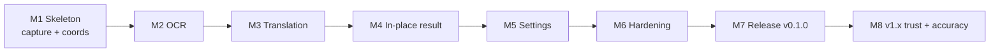

# Execution Roadmap

> **Purpose.** The build order — what gets made, in what sequence, and what "done" means for each milestone.
> **Related.** [../product/roadmap-vision.md](../product/roadmap-vision.md) · [../progress.md](../progress.md) · [definition-of-done.md](definition-of-done.md)

## Sequencing principle

**Prove the risky, un-Googleable parts first.** The two things that sink this project are multi-monitor DPI
geometry and OCR accuracy — both are hard to retrofit and both are invisible in a demo until they break. So M1
builds a walking skeleton straight through the riskiest path, and the polish comes after the loop is real.

## Milestones

### M1 — Walking skeleton: hotkey → frozen frame → crop

**Goal.** Prove the capture and coordinate model on a real multi-monitor mixed-DPI setup.

**Scope**

- Tauri v2 shell, tray icon, single-instance guard, clean quit (FR-01, FR-02, FR-04)
- Global hotkey registration (FR-10)
- Virtual-desktop capture, monitor topology enumeration, physical-pixel coordinate space (FR-20, FR-21)
- Borderless always-on-top overlay window rendering the frozen frame, with drag selection and `Esc` (FR-22–FR-26)
- Crop the selection from the in-memory frame and dump it to a file, to eyeball correctness (FR-30)

**Done when** — a box drawn on a 150%-scaled monitor produces a crop containing exactly what was inside it, and the
same holds on a 100% secondary monitor and across the boundary between them.

**Status** — `not started`

---

### M2 — OCR: pixels → structured text

**Goal.** Get accurate, positioned text out of a crop.

**Scope**

- `OcrEngine` trait + `Windows.Media.Ocr` implementation (FR-32, NFR-M1)
- Pre-processing ladder: upscale, grayscale, contrast normalize, adaptive threshold (FR-31)
- Line assembly into blocks with `full_text` preserving paragraph structure
- Source language detection; installed-language-pack detection with an actionable message (FR-33, FR-34)
- Empty-result handling (FR-35)

**Done when** — a fixture set of real screenshots (small UI text, low contrast, monospace, a paragraph of prose)
recognizes correctly, with bounding boxes that land on the right lines.

**Depends on** — M1.
**Status** — `not started`

---

### M3 — Translation: text → meaning

**Goal.** One batched request per capture, provider-agnostic.

**Scope**

- `TranslationProvider` trait + LibreTranslate, DeepL, Google, and LLM implementations (FR-41, NFR-M1)
- Batched single-request translation with per-line segment reconstruction (FR-42)
- Target language defaulting to the Windows display language (FR-40)
- Same-language skip (FR-43)
- Typed provider errors with actionable messages; source text survives failure (FR-44)
- Settings JSON persistence + Credential Manager for keys (FR-61, FR-62)

**Done when** — the same capture translates correctly through each provider, one outbound request per capture, and
pulling the network still leaves the OCR text on screen and copyable.

**Depends on** — M2.
**Status** — `not started`

---

### M4 — The result: in-place overlay + panel

**Goal.** The headline feature, and the reason this isn't just another screenshot tool.

**Scope**

- Translated lines drawn at their source bounding boxes inside the overlay (FR-50)
- The fitting ladder: shrink → wrap → clip-with-hover, with a legibility floor (FR-51, NFR-U8)
- Re-select without re-triggering the hotkey (FR-26)
- Result panel: frameless, always-on-top, copy source / copy translation (FR-52, FR-53)
- Re-translate from cached OCR text (FR-54); display mode setting (FR-55)

**Done when** — the full loop runs end to end: press, drag, read the translation in place, drag again, copy, `Esc`.

**Depends on** — M3.
**Status** — `not started`

---

### M5 — Settings & autostart

**Goal.** Make it configurable and permanent.

**Scope**

- Settings window: language, capture, translation, general groups (FR-60, F9)
- Live hotkey rebinding with visible conflict errors (FR-11, FR-12)
- Autostart toggle with registry entry and stale-path repair (FR-05, F2)
- Test-connection action (FR-63)
- First-run flow: detect display language, ask about autostart once

**Done when** — every setting persists, applies without a restart, and survives a reboot.

**Depends on** — M4.
**Status** — `not started`

---

### M6 — Hardening: performance, errors, tests

**Goal.** Make the budgets real rather than intended.

**Scope**

- Meet every budget in [../product/requirements-nfr.md](../product/requirements-nfr.md): idle RAM, idle CPU, end-to-end latency, peak memory released after close
- Error taxonomy wired through the whole pipeline ([../operations/error-handling.md](../operations/error-handling.md))
- Logging with the no-content rule enforced ([../operations/logging.md](../operations/logging.md))
- Test suite per [../quality/testing-strategy.md](../quality/testing-strategy.md): fixture-image OCR tests, fake-provider pipeline tests, coordinate-math unit tests
- Display topology change handling (NFR-R4); no invisible-overlay lockup path (NFR-R1)

**Done when** — measured numbers are recorded in this repo and meet the targets, and the QA checklist passes.

**Depends on** — M5.
**Status** — `not started`

---

### M7 — Release v0.1.0

**Goal.** A stranger can install it and it works.

**Scope**

- GitHub Actions build on `windows-latest`: MSI + portable exe ([../operations/ci-cd.md](../operations/ci-cd.md))
- README with the privacy statement, install instructions, and a real screenshot/GIF
- LICENSE (MIT), CHANGELOG entry, clean-machine install verification
- [../quality/qa-checklist.md](../quality/qa-checklist.md) run in full on a machine that isn't the dev box
- Document the unsigned-binary / SmartScreen situation honestly in the README

**Done when** — a clean Windows VM goes from downloaded MSI to a working translation without touching a doc.

**Depends on** — M6.
**Status** — `not started`

---

### M8 — v1.x: trust and accuracy

**Goal.** Remove the reasons someone would abandon it. Scope is directional until v0.1.0 ships and real failures
arrive; see [../product/roadmap-vision.md](../product/roadmap-vision.md) → Next.

**Candidates** — Tesseract as a second OCR engine · provider reliability and the keyless-default decision
([PRD Q1](../product/prd.md#open-questions)) · translation history · save annotated capture · code signing
([PRD Q2](../product/prd.md#open-questions)) · accuracy work driven by real misses.

**Status** — `not started`

## Dependencies

**External dependencies**

| Dependency                       | Needed by | Risk if it fails                                                       |
| -------------------------------- | --------- | ------------------------------------------------------------------------ |
| `Windows.Media.Ocr` availability  | M2        | Low — shipped with Windows 10 1809+. Mitigated by the engine trait.     |
| Windows OCR language packs        | M2        | Medium — user must install some languages; detected and guided (FR-34). |
| Keyless default provider uptime   | M3        | **High** — public instances rate-limit. Open question [Q1](../product/prd.md#open-questions). |
| GitHub Actions Windows runners    | M7        | Low — free for public repos.                                            |
| Code-signing certificate          | M8        | Medium — cost vs. SmartScreen friction, undecided ([Q2](../product/prd.md#open-questions)). |

## Not scheduled

Live mode, offline translation, TTS, glossary, auto-update, and macOS/Linux ports are **Later** in the vision doc
and deliberately have no milestone. They get one when v1 has real users.
